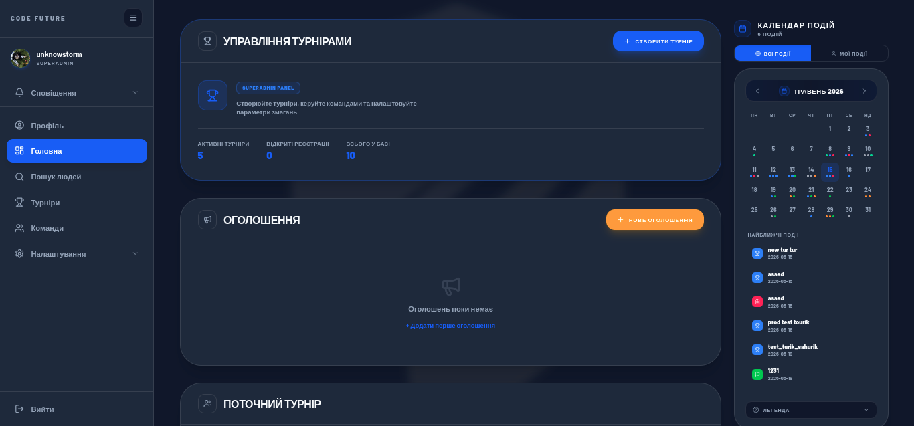
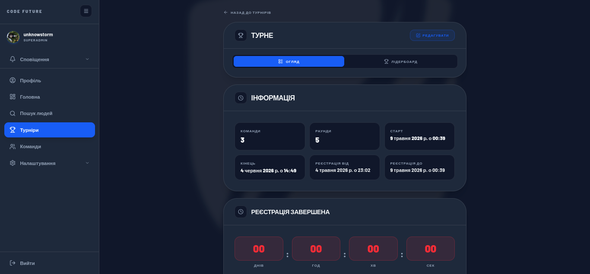
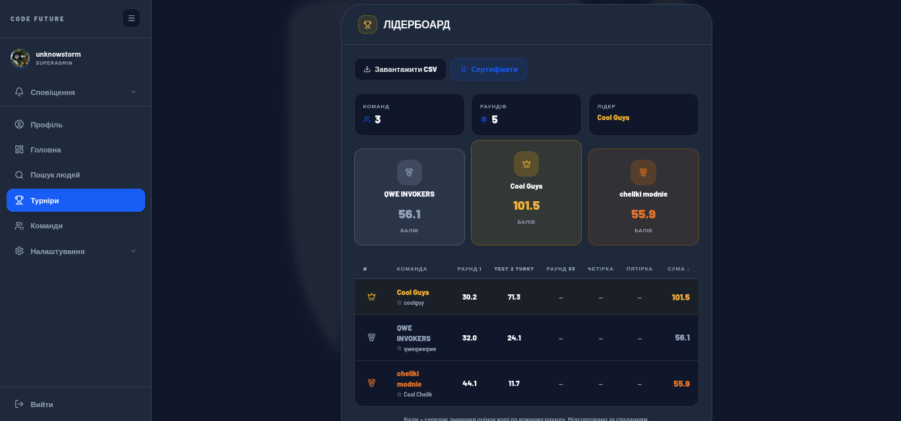
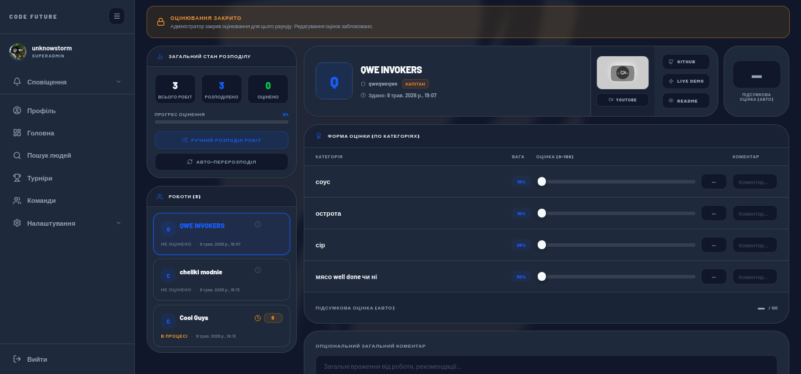
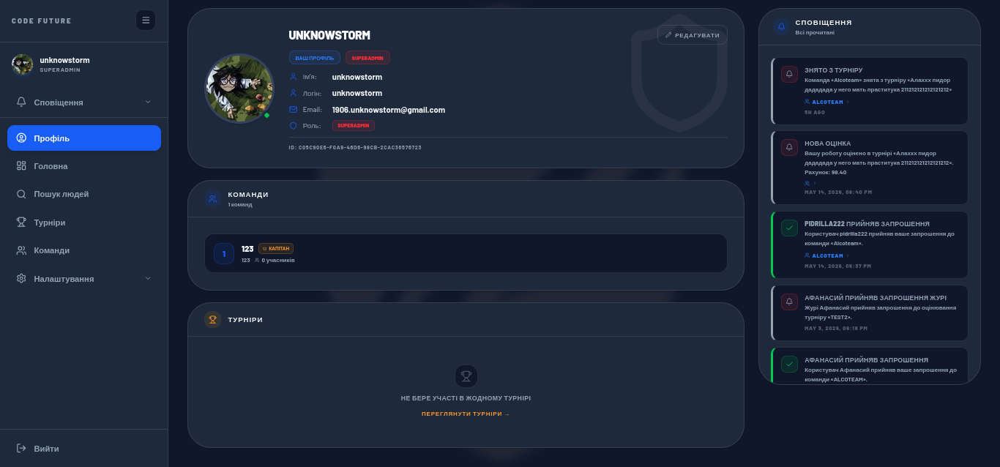
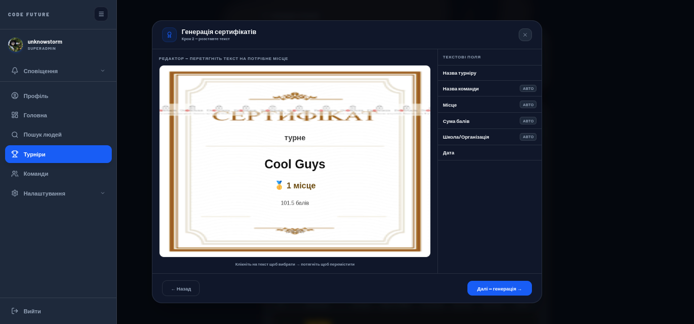
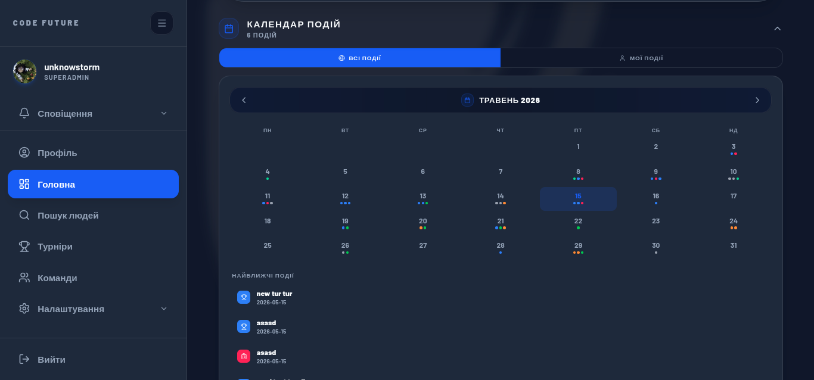

# CodeFuture 🏆

> Платформа для організації IT-турнірів та хакатонів — від реєстрації до фінального leaderboard.  
> Розроблено командою **CrutchMasters**

---

## 📋 Зміст

- [Про проєкт](#про-проєкт)
- [Скриншоти](#скриншоти)
- [Функціонал](#функціонал)
- [Технологічний стек](#технологічний-стек)
- [Структура проєкту](#структура-проєкту)
- [Швидкий старт](#швидкий-старт)
- [API](#api)
- [База даних](#база-даних)

---

## Про проєкт

**CodeFuture** — комплексна екосистема для проведення IT-турнірів та хакатонів. Платформа об'єднує три ролі: **організатори**, **учасники** та **жюрі** — і супроводжує їх від створення турніру до оголошення переможців.

---

## Скриншоти

| | |
|---|---|
|  |  |
| *Dashboard — головна панель* | *Сторінка турніру* |
|  |  |
| *Лідерборд* | *Панель оцінювання жюрі* |
|  |  |
| *Подача рішення* | *Профіль користувача* |
|  |  |
| *Редактор сертифікатів* | *Календар подій* |


---

## Функціонал

Платформа побудована навколо трьох ролей: **організатор** (admin), **учасник** (user) та **жюрі** (jury). Кожна роль має свій набір можливостей та інтерфейс.

---

### 🔐 Авторизація та ролі

- Реєстрація через email з підтвердженням OTP-кодом (6 цифр на пошту)
- Вхід за логіном або email + пароль
- Скидання паролю через email-посилання
- Чотири рівні доступу: `user` → `jury` → `admin` → `superadmin`
- JWT-авторизація з підтримкою як HS256, так і ES256 (JWKS)
- Автоматичне оновлення токенів без виходу із системи

---

### 🏆 Управління турнірами (для організаторів)

- Створення турніру з повним набором параметрів:
  - назва, опис, правила (Rich Text Editor з підтримкою форматування)
  - дата та час початку/кінця турніру
  - окреме вікно реєстрації команд (від/до)
  - мінімальний та максимальний розмір команди
  - максимальна кількість команд
  - кількість раундів та їх індивідуальні налаштування
- Статуси турніру з автоматичним переходом за розкладом (APScheduler):
  - `upcoming` → `registration` → `ongoing` → `finished`
- Завантаження та редагування банера турніру (кроп, зміна через BannerEditorModal)
- Публічна сторінка турніру з вкладками «Інформація» та «Лідерборд»
- Список зареєстрованих команд з аватарами та складом
- Список членів жюрі
- Редагування всіх параметрів турніру після створення
- Видалення турніру організатором
- Налаштування кількості жюрі на одну роботу (`jury_per_submission`)

---

### 📋 Раунди

- Кожен турнір має один або кілька раундів з незалежними налаштуваннями
- Для кожного раунду задаються: назва, опис, дати початку/кінця, статус
- Критерії оцінювання для кожного раунду є **обов'язковими** — без них раунд не може бути створений
- Організатор задає довільну кількість критеріїв із назвами та вагами у відсотках (сума ваг має дорівнювати 100%)
- Ручна зміна статусу раунду організатором
- Прикріплення файлів до раунду (умови завдання, матеріали)

---

### 👥 Команди та учасники

- Створення команди з назвою та прив'язкою до міста/школи/організації
- Роль капітана: управління складом, редагування команди, розпуск
- Запрошення учасників двома способами:
  - пошук по платформі (за username)
  - надсилання email-запрошення
- Прийняття/відхилення запрошень у профілі
- Кік учасника капітаном
- Валідація при реєстрації на турнір: перевірка мін/макс складу, унікальності учасників
- Аватар команди через AvatarEditorModal (кроп зображення)
- Сторінка команди: склад, турніри, статуси

---

### 📝 Подача рішень (Submissions)

- Форма сабміту містить:
  - посилання на GitHub-репозиторій
  - посилання на YouTube-демо
  - посилання на live-версію проєкту
  - текстовий опис у Rich Text Editor
  - прикріплення файлів (підтримуються: зображення, відео, PDF, архіви, код, інші)
- Живий таймер зворотного відліку до дедлайну прямо на сторінці
- Статус сабміту: `draft` / `submitted` / `evaluated`
- Можливість оновити сабміт до закриття раунду
- Видалення окремих файлів із сабміту
- Перегляд власного сабміту після подачі
- Організатор/жюрі бачать список усіх сабмітів раунду з деталями

---

### ⚖️ Система жюрі та оцінювання

**Запрошення жюрі:**
- Надсилання запрошення через email із токеном (унікальне посилання)
- Реєстрація жюрі за посиланням з автоматичним прийняттям ролі
- Запрошення безпосередньо зареєстрованих користувачів платформи
- Перегляд і управління списком жюрі турніру

**Розподіл робіт:**
- Автоматичний розподіл: алгоритм балансує навантаження між членами жюрі — кожен отримує приблизно однакову кількість робіт
- Рандомний tie-breaking при однаковому навантаженні (захист від упередженості)
- Ручний перерозподіл усіх робіт (redistribute)
- Частковий перерозподіл: тільки нові або нерозподілені роботи (partial redistribute)
- Ручне призначення конкретної роботи конкретному журисту

**Оцінювання:**
- Панель жюрі з навігацією по призначених роботах
- Для кожної роботи: перегляд GitHub, відео-демо, опису, файлів
- Оцінка по кожному критерію (0–100) з урахуванням ваги критерію
- Текстовий коментар до кожного критерію
- Загальний бал розраховується автоматично: `Σ (score × weight / 100)`
- Статуси оцінювання: `not_evaluated` / `in_progress` / `evaluated`
- Перегляд прогресу оцінювання по раунду (скільки оцінено із загального числа)

---

### 📊 Лідерборд та аналітика

- Динамічний лідерборд турніру з місцями (🥇🥈🥉 + числові позиції)
- Розбивка балів по кожному раунду окремо
- Сортування за загальним балом
- Фільтрація та відображення: назва команди, місто/школа, капітан
- Експорт результатів у CSV з усіма раундами та балами (у форматі UTF-8 BOM для Excel)

---

### 📄 Сертифікати

- Вбудований редактор сертифікатів із завантаженням власного шаблону (зображення)
- Інтерактивне позиціонування текстових полів на Canvas (drag & drop)
- Налаштування для кожного поля: шрифт, розмір, колір, жирність, вирівнювання
- Динамічні поля: `{{team_name}}`, `{{place}}`, `{{score}}`, `{{date}}`
- Режими генерації: для всіх команд або тільки для переможців (топ-3)
- Масова генерація та скачування PDF-сертифікатів через jsPDF

---

### 📅 Dashboard та Calendar

- Головна сторінка (Dashboard) з персоналізованим контентом:
  - Поточний активний турнір та раунд учасника
  - Статус останнього сабміту
  - Живий таймер до кінця раунду (дні/години/хвилини/секунди)
  - Оголошення від організаторів із підтримкою Rich Text, посилань та pin
- Оголошення підтримують прев'ю посилань (OG-теги, автоматична YouTube-обкладинка)
- Оголошення можна додавати до календаря подій
- Інтерактивний EventCalendar з відображенням дат реєстрацій, раундів, дедлайнів
- TournamentTimeline — горизонтальний таймлайн із фазами турніру

---

### 🔔 Сповіщення

- Внутрішні сповіщення з типами та кольоровим маркуванням:
  - `team_invitation` — запрошення в команду
  - `invitation_accepted` / `invitation_declined` — відповідь на запрошення
  - `jury_invitation` — запрошення до жюрі
- Лічильник непрочитаних у сайдбарі
- Позначення прочитаними (одне або всі одразу)
- Email-нотифікації (вмикаються/вимикаються у профілі окремо)

---

### 👤 Профіль користувача

- Редагування username та відображуваного імені
- Зміна аватара через AvatarEditorModal (кроп, завантаження у Supabase Storage)
- Зміна паролю
- Перегляд і управління своїми командами
- Для жюрі: окремий розділ із призначеними турнірами, раундами та роботами
- Список активних запрошень із можливістю прийняти/відхилити прямо з профілю
- Стрічка сповіщень у профілі

---

### 🌐 UI / UX

- Двомовний інтерфейс: **English**, **Українська** (i18n через LanguageContext)
- Перемикання теми: темна / світла (зберігається між сесіями)
- Адаптивний дизайн: повноцінна мобільна версія з MobileHeader та бургер-меню
- Rich Text Editor (форматування тексту в описах та оголошеннях)
- Markdown-рендерінг для перегляду описів
- Живі таймери зворотного відліку (хук `useCountdown`)
- Прев'ю посилань з автоматичним отриманням OG-метаданих

---

## Технологічний стек

### Frontend
| Технологія | Версія | Призначення |
|---|---|---|
| Next.js | 16.x | React-фреймворк, SSR/SSG |
| React | 19.x | UI-бібліотека |
| TypeScript | 5.x | Типізація |
| Tailwind CSS | 4.x | Стилізація |
| Supabase JS | 2.x | Клієнт БД та авторизації |
| Lucide React | 0.577 | Іконки |
| jsPDF | 4.x | Генерація PDF |

### Backend
| Технологія | Версія | Призначення |
|---|---|---|
| FastAPI | 0.129 | REST API фреймворк |
| Uvicorn | 0.41 | ASGI-сервер |
| Supabase Python | 2.28 | Клієнт БД |
| PyJWT | 2.11 | JWT-авторизація |
| APScheduler | 3.11 | Фонові задачі за розкладом |
| Pydantic | 2.x | Валідація даних |
| python-dotenv | 1.2 | Змінні оточення |

### Інфраструктура
- **Supabase** — PostgreSQL БД, авторизація, файлове сховище
- **Cloudflare** — хостинг фронтенду через OpenNext
- **Render** — хостинг бекенду (FastAPI + Uvicorn)

---

## Структура проєкту

```
site_turing_CrutchMasters_team-s-main/
├── frontend/                   # Next.js додаток
│   └── src/
│       ├── app/                # Сторінки (App Router)
│       │   ├── dashboard/      # Головна панель користувача
│       │   ├── tournaments/    # Список та сторінки турнірів
│       │   ├── teams/          # Команди
│       │   ├── rounds/         # Раунди та сабміти
│       │   ├── jury/           # Панель жюрі (розподіл, оцінювання)
│       │   ├── profile/        # Профіль користувача
│       │   ├── notifications/  # Сповіщення
│       │   ├── search/         # Пошук
│       │   ├── register/       # Реєстрація
│       │   └── login/          # Вхід
│       ├── components/         # Переиспользовані компоненти
│       ├── context/            # Auth, Language, Sidebar контексти
│       ├── hooks/              # Кастомні хуки (useTheme)
│       └── lib/                # API-клієнт, Supabase, утиліти
├── backend/                    # FastAPI додаток
│   ├── main.py                 # Весь бекенд (єдиний файл)
│   └── requirements.txt        # Python-залежності
└── database/                   # CSV-схеми та приклади даних
```

---

## Швидкий старт

### Вимоги
- Ubuntu 20.04+ (або будь-який Linux)
- Node.js 20+ (встановлюється через NVM)
- Python 3.10+
- Обліковий запис [Supabase](https://supabase.com)

### Налаштування Supabase

Перед запуском створіть проєкт у Supabase та додайте змінні оточення.

Для **frontend** створіть файл `frontend/.env.local`:
```env
NEXT_PUBLIC_SUPABASE_URL=https://ваш-проєкт.supabase.co
NEXT_PUBLIC_SUPABASE_ANON_KEY=ваш-anon-key
NEXT_PUBLIC_API_URL=http://localhost:8000
```

Для **backend** створіть файл `backend/.env`:
```env
SUPABASE_URL=https://ваш-проєкт.supabase.co
SUPABASE_KEY=ваш-service-role-key
SUPABASE_JWT_SECRET=ваш-jwt-secret
```

---

### 🖥 Встановлення Frontend

```bash
# 1. Оновлення системи
sudo apt update && sudo apt upgrade -y

# 2. Встановлення curl
sudo apt install curl

# 3. Встановлення NVM
curl -o- https://raw.githubusercontent.com/nvm-sh/nvm/v0.39.7/install.sh | bash

# 4. Завантаження NVM у поточну сесію
export NVM_DIR="$HOME/.nvm"
[ -s "$NVM_DIR/nvm.sh" ] && \. "$NVM_DIR/nvm.sh"
[ -s "$NVM_DIR/bash_completion" ] && \. "$NVM_DIR/bash_completion"

# або просто:
source ~/.bashrc

# 5. Встановлення Node.js 20
nvm install 20
nvm use 20

# 6. Перехід до директорії фронтенду та встановлення залежностей
cd site_turing_CrutchMasters_team-s-main/frontend
npm install

# 7. Запуск у режимі розробки
npm run dev
```

Фронтенд буде доступний за адресою: **http://localhost:3000**

---

### ⚙️ Встановлення Backend

```bash
# 1. Встановлення python3-venv (якщо ще не встановлено)
sudo apt install python3-venv

# 2. Перехід до директорії бекенду
cd site_turing_CrutchMasters_team-s-main/backend

# 3. Створення віртуального оточення
python3 -m venv venv

# 4. Активація оточення
source venv/bin/activate

# 5. Встановлення залежностей
pip install -r requirements.txt
```

> **Примітка:** Бекенд задеплоєний на [Render](https://render.com). При локальній розробці він запускається автоматично через Render — локальний запуск `uvicorn` не потрібен. Достатньо вказати у `frontend/.env.local` актуальний URL з Render як `NEXT_PUBLIC_API_URL`.

Swagger-документація: **https://ваш-сервіс.onrender.com/docs**

---

### Запуск в продакшн-режимі

**Frontend:**
```bash
npm run build
npm run start
```

**Backend:**
```bash
uvicorn main:app --host 0.0.0.0 --port 8000 --workers 4
```

---

## API

Основні групи ендпоінтів:

| Група | Опис |
|---|---|
| `/api/register`, `/api/login` | Реєстрація та авторизація |
| `/api/users/*` | Профіль, пошук, налаштування |
| `/api/teams/*` | Команди, запрошення, кік |
| `/api/tournaments/*` | Турніри, банер, лідерборд |
| `/api/rounds/*` | Раунди, сабміти, оцінювання, розподіл |
| `/api/invitations/*` | Запрошення учасників |
| `/api/jury-invitations/*` | Запрошення та управління жюрі |
| `/api/notifications/*` | Сповіщення |
| `/api/upload/*` | Завантаження файлів |

Повна інтерактивна документація доступна за `/docs` після запуску бекенду.

---

## База даних

Схема зберігається у директорії `database/`. Основні таблиці:

- `accounts` — користувачі та їх ролі
- `teams` — команди
- `tournaments` — турніри
- `rounds` — раунди турніру
- `submissions` — подані рішення
- `jury_tournament_invitations` — жюрі турніру
- `jury_submission_assignments` — розподіл робіт між жюрі
- `team_invitations` — запрошення до команд
- `notifications` — внутрішні сповіщення

---

## Ліцензія

MIT © CrutchMasters Team — made with ❤️ at Turing Hackathon

---

## Від автора

*by_unknowstorm:*

Здоров'я, дорогі друзі. Сподіваюся, переглядаючи наш репозиторій, ви натрапите на це звернення. Просиджуючи чергові вісім годин за робочим столом, я замислився над змістом своєї роботи — тому сповідую свої думки саме того моменту.

Хочу розповісти, яким був цей шлях. Він був складним, тернистим, але найголовніше — корисним. Цей досвід важливий для кожного. Досвід створення чогось нового. Тому кожному бажаю пережити його — яким би складним він не здавався і безмежно варіативним не був.

Дякую. До зустрічі.

*P.S. Торт — це брехня.*
